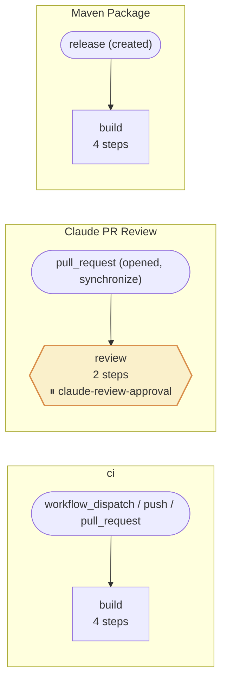

<!-- Auto-generated by scripts/generate_pipeline_diagram.py — do not edit by hand. -->
# CI/CD pipeline

Diagram of every workflow in `.github/workflows/`, regenerated on each change by the `Pipeline diagram` action. Hexagon nodes gate on a required-reviewer environment (⏸).

